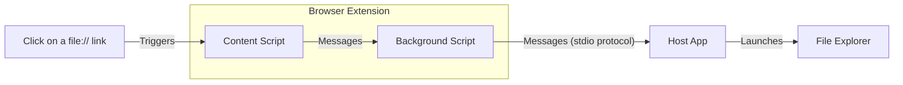

# Introduction 
The project includes an **Edge extension** and a **standalone Win32 binary** that work together to allow the user to open a `file://...` link in **Windows File Explorer**.

# Installation
As the extension is not available on Microsoft Edge Add-ons website yet, it needs to be installed manually.
Follow the steps below to install the extension manually:

1. Get a clone of this repository.
2. Start Microsoft Edge browser and navigate to edge://extensions/
3. Enable **Developer mode** by clicking the toggle on the side menu.
4. Click on **Load unpacked** button and choose folder **edge-extension**.
5. Go to folder **native-app-win32** and run **register-host-app.bat** to register the host application. In case the repository folder has been moved to a new location, the registration must be updated by running **register-host-app.bat** again in the new location. Alternatively, use the [installer](https://github.com/ggininla/LocalFileOpenerForEdge/blob/main/native-app-win32/bin/FileExplorerLauncherForEdge-Installer-Win64-1.0.0.exe) to do system-wiide installation.

# Build
The extension does not need to be built. The JS scripts are loaded and executed by the browser.

The standalone application needs to be built with a C++ compiler. In the source folder a solution and a project file can be found for Microsoft Visual Studio IDE. It is a very straighforward project that does not require any third-party libraries. Only Windows standard built-in libraries are used. 

# Design
The Edge extension comes with [a required manifest](https://learn.microsoft.com/en-us/microsoft-edge/extensions-chromium/getting-started/manifest-format?tabs=v3) and two scripts written in JavaScript:
1. [Content script](./edge-extension/content-script.js): The script is executed when a new tab is created. It registers event handler for `click` event to capture links starting with `file://`. When click on such a hyperlink is captured, it sends a message to the background service.
2. [Background script](./edge-extension/background.js): The script is executed once Edge has started. It listens to messages from the content script and launches a native [host application](./native-app-win32/source/FileExplorerLauncher/FileExplorerLauncher.cpp) to handle access to a processed [UNC path](https://www.pcmag.com/encyclopedia/term/unc#:~:text=(Universal%20Naming%20Convention)%20A%20standard,the%20name%20of%20the%20computer.).

See below for how it works.


Message passing between components within the extension is implemented using [chrome.runtime.sendMessage](https://developer.chrome.com/docs/extensions/reference/runtime/#method-sendMessage) API, while the communication between the extension and the host application uses [chrome.runtime.sendNativeMessage](https://developer.chrome.com/docs/extensions/reference/runtime/#method-sendNativeMessage) API. The latter one is based on a [binary protocol](https://developer.mozilla.org/en-US/docs/Mozilla/Add-ons/WebExtensions/Native_messaging#app_side) using standard input/output (`stdin`, `stdout`).

The host app is defined by [a manifest](./native-app-win32/manifest.json), which is located by [adding an entry](./native-app-win32/register-host-app.bat) to Windows registry.
```
HKEY_CURRENT_USER\SOFTWARE\Chromium\NativeMessagingHosts\nz.govt.at.file_explorer_launcher
```

# Copyright
Copyright (c) 2023, Auckland Transport. All right reserves.
